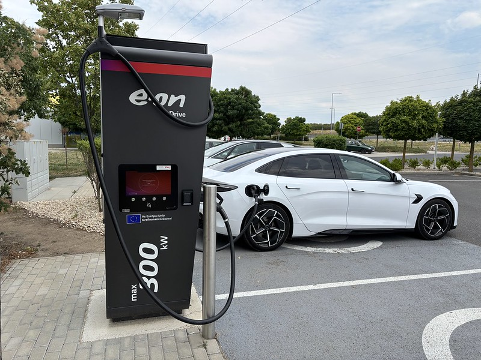

# EV Charging System ⚡

# Overview

A full-stack, production-ready EV Charging System featuring a customer-facing application, an admin portal, and a robust Central Management System (CPMS) backend compliant with OCPP.

**Live Demo:** [Customer App](https://your-customer-app.vercel.app) | [Admin Portal](https://your-admin-app.vercel.app)  
**Backend API:** [https://your-api.onrender.com](https://your-api.onrender.com)

# Features
📂 Direct Uploads: Secure presigned URLs for direct S3 uploads

🗜️ Automatic Compression: Intelligent image and video compression

⚡ Scalable Architecture: Serverless design using AWS Lambda

📊 Real-time Status: Track processing status from upload to completion

💻 Responsive UI: React-based frontend for seamless user experience

🏗️ Infrastructure as Code: Terraform and CloudFormation for easy deployment

# ARCHITECTURE

# PROJECT STRUCTURE
    media-processing-system/  
    ├── backend/           
    │   ├── media_processing/   
    │   │   ├── models.py  
    │   │   ├── serializers.py   
    │   │   ├── views.py   
    │   │   ├── tasks.py   
    │   │   └── utils.py  
    │   ├── config/  
    │   │   ├── settings.py  
    │   │   └── urls.py  
    │   └── manage.py  
    ├── lambda-functions/           
    │   ├── image-compressor/  
    │   │   ├── app.py  
    │   │   ├── requirements.txt  
    │   │   └── Dockerfile  
    │   ├── video-compressor/  
    │   │   ├── app.py  
    │   │   ├── requirements.txt  
    │   │   └── Dockerfile  
    │   └── shared/       
    │       └── s3_utils.py  
    ├── infrastructure/       
    │   ├── terraform/  
    │   │   ├── main.tf   
    │   │   ├── variables.tf   
    │   │   └── outputs.tf  
    │   └── cloudformation/   
    │       └── media-processing-stack.yaml   
    ├── frontend/         
    │   ├── src/  
    │   │   ├── components/   
    │   │   │   └── MediaUploader.js     
    │   │   └── services/    
    │   │       └── api.js  
    │   └── package.json  
    └── README.md

# Quick Start
## Prerequisites

    Python 3.8+

    Node.js 14+

    AWS Account

    Terraform 1.0+ (optional)

    Docker (for Lambda deployment)

# Installation
## 1. Clone the repository
    git clone https://github.com/your-username/media-processing-system.git
    cd media-processing-system

