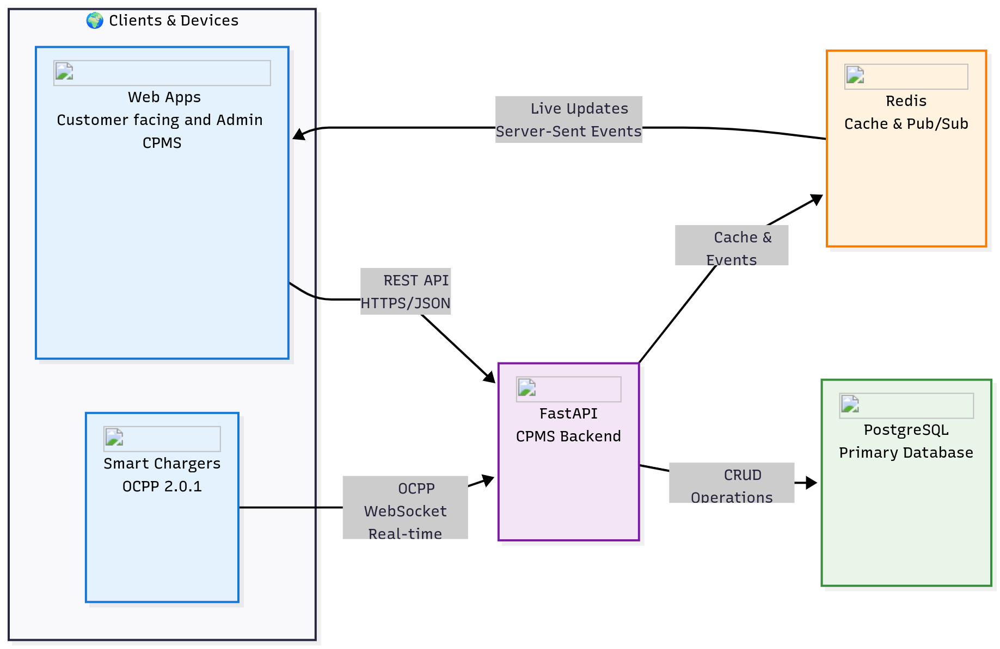

# EV Charging Management System (CPMS) ⚡

Customer App | Admin Dashboard | Cloud-Deployed CPMS Backend

# 🧩 Overview

This is a cloud-deployed, scalable Electric Vehicle (EV) Charging Platform built to simulate real-world charging operations using the Open Charge Point Protocol (OCPP 2.0.0).
The system enables EV drivers to locate charge points, start, monitor, and stop charging sessions, while allowing operators to manage charge points, users, and infrastructure. The system is powered by a Charge Point Management System (CPMS) backend that leverages PostgreSQL for persistence, Redis for caching and pub/sub messaging, and WebSockets for real-time charge session updates and event-driven communication.

## 🚗 Problem Statement

The rapid growth of electric vehicles in the UK demands robust and scalable systems to manage EV charging infrastructure.
Existing systems often face challenges like:

- Poor scalability under high user load
- Slow response times for real-time operations (e.g., start/stop sessions)
- Inefficient charge point communication and monitoring
- Difficulty synchronizing customer and admin activities

---
This project addresses these issues by implementing a cloud-native, event-driven, and protocol-compliant CPMS that supports real-time user interaction, operator management, and data-driven scalability.

**Live Demo:** [Customer App](https://ev-charging-frontend-seven.vercel.app) | [Admin Portal](https://ev-charging-frontend-ss5m.vercel.app/)  

# ARCHITECTURE

### FastAPI Backend (CPMS)

- Implements OCPP 2.0.0 to simulate communication between charge points and the backend.

- Provides REST APIs for admin and customer apps.

- Uses WebSockets for live session updates.

- Integrates Redis for pub/sub events and performance caching.

- Persists data with PostgreSQL.

### Frontend Apps (Customer & Admin)

- Customer App: Enables users to locate charge points, start, monitor, and stop charging sessions.

- Admin App: Allows operators to view usage stats, manage charge points, monitor active sessions, and control pricing.

### Deployment

- Frontend: Deployed on Vercel for global scalability and CDN delivery.

- Backend: Deployed on Render, integrated with managed PostgreSQL and Redis services.

# Installation (Lecal environment)
## 1. Clone the repository
    git https://github.com/Emmanuel-Iyahen/EV-CHARGING-SYSTEM.git
    cd cpms-backend

## 1. Create virtual environment
    virtualenv venv

## 1. install dependencies  
    pip install -r requirements.txt

## 1. Run application
    pip install -r requirements.txt