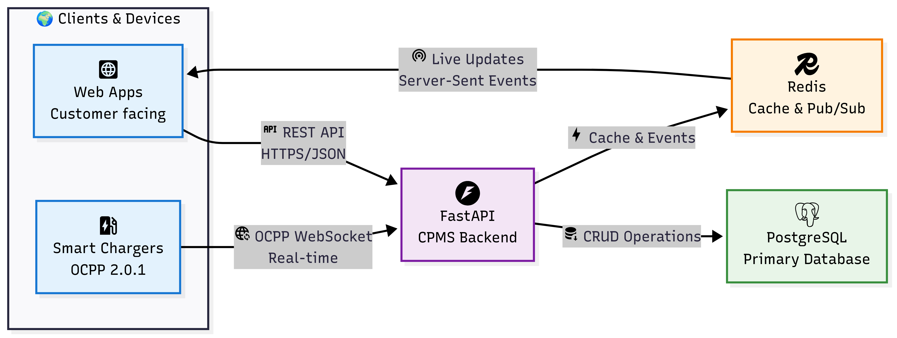

# EV Charging Management System (CPMS) ⚡

Customer App | Admin Dashboard | Cloud-Deployed CPMS Backend

# 🧩 Overview

This is a cloud-deployed, scalable Electric Vehicle (EV) Charging Platform built to simulate real-world charging operations using the Open Charge Point Protocol (OCPP 2.0.0).
The system enables EV drivers to locate charge points, start, monitor, and stop charging sessions, while allowing operators to manage charge points, users, and infrastructure. The system is powered by a Charge Point Management System (CPMS) backend that leverages PostgreSQL for persistence, Redis for caching and pub/sub messaging, and WebSockets for real-time charge session updates and event-driven communication.

## 🚗 Problem Statement

The rapid growth of electric vehicles in the UK demands robust and scalable systems to manage EV charging infrastructure.
Existing systems often face challenges like:

- Poor scalability under high user load
- Slow response times for real-time operations (e.g., start/stop sessions)
- Inefficient charge point communication and monitoring
- Difficulty synchronizing customer and admin activities

---
This project addresses those issues by building a cloud-native, event-driven, and protocol-compliant CPMS that supports real-time user interaction, operator management, and data-driven scalability.

**Live Demo:** [Customer App](https://ev-charging-frontend-seven.vercel.app) | [Admin Portal](https://your-admin-app.vercel.app)  
**Backend API:** [https://your-api.onrender.com](https://your-api.onrender.com)

# ARCHITECTURE

# PROJECT STRUCTURE
    media-processing-system/  
    ├── backend/           
    │   ├── media_processing/   
    │   │   ├── models.py  
    │   │   ├── serializers.py   
    │   │   ├── views.py   
    │   │   ├── tasks.py   
    │   │   └── utils.py  
    │   ├── config/  
    │   │   ├── settings.py  
    │   │   └── urls.py  
    │   └── manage.py  
    ├── lambda-functions/           
    │   ├── image-compressor/  
    │   │   ├── app.py  
    │   │   ├── requirements.txt  
    │   │   └── Dockerfile  
    │   ├── video-compressor/  
    │   │   ├── app.py  
    │   │   ├── requirements.txt  
    │   │   └── Dockerfile  
    │   └── shared/       
    │       └── s3_utils.py  
    ├── infrastructure/       
    │   ├── terraform/  
    │   │   ├── main.tf   
    │   │   ├── variables.tf   
    │   │   └── outputs.tf  
    │   └── cloudformation/   
    │       └── media-processing-stack.yaml   
    ├── frontend/         
    │   ├── src/  
    │   │   ├── components/   
    │   │   │   └── MediaUploader.js     
    │   │   └── services/    
    │   │       └── api.js  
    │   └── package.json  
    └── README.md

# Quick Start
## Prerequisites

    Python 3.8+

    Node.js 14+

    AWS Account

    Terraform 1.0+ (optional)

    Docker (for Lambda deployment)

# Installation
## 1. Clone the repository
    git clone https://github.com/your-username/media-processing-system.git
    cd media-processing-system

